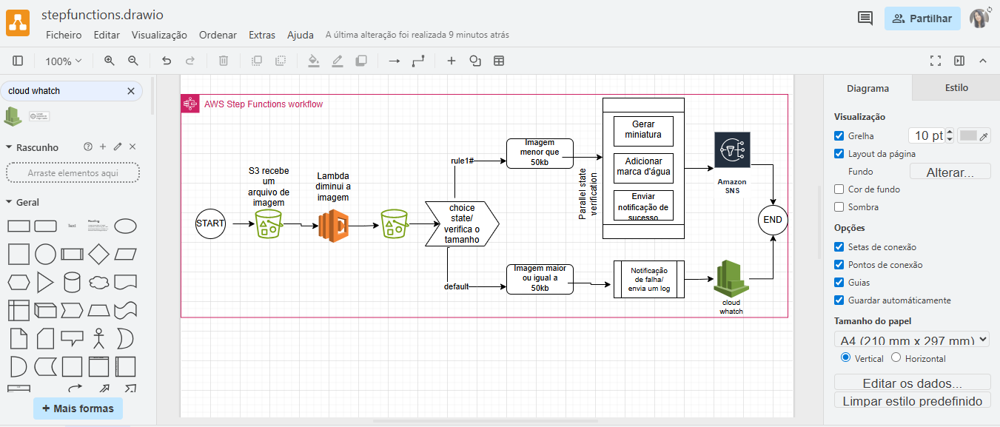

# Projeto-step functions
Projeto para o Bootcamp CodeGirls DIO/SantanderOPenAcademy

## O que é o AWS Step Functions?
* Step Functions é um orquestrador de fluxos de trabalho serverless na AWS. Ele permite que você conecte e coordene diferentes serviços da nuvem (como funções Lambda, serviços de machine learning, etc.) de uma forma visual e sem precisar escrever código de orquestração complexo. O resultado é um fluxo de trabalho automatizado, robusto e escalável. O ponto-chave é que ele orquestra o que já existe, e não cria os serviços do zero. Ele conecta os microserviços e outros serviços da AWS que você já criou.

***Você pode ter, por exemplo:***

1 - Uma função Lambda para processar um dado.

2 - Um serviço de machine learning para analisar esse dado.

3 - Um serviço de notificação para enviar um e-mail com o resultado.

O Step Functions vai ser o "mapa" que define a ordem em que essas etapas acontecem. Você o configura para dizer: "Primeiro, chame a Lambda. Se a Lambda der certo, chame o serviço de ML. E, no final, envie a notificação."Ele cuida de toda a lógica de estado: se uma etapa falhar, ele pode tentar novamente ou seguir um caminho de erro que você definiu.
* O Step Functions é baseado em state machines and tasks. As máquinas de estado são chamadas de workflows, que são uma série de etapas orientadas a eventos. Cada etapa no workflows é chamada de state.Um workflow é definido usando a Amazon States Language, também conhecida como ASL uma linguagem baseada em JSON. Cada etapa de um fluxo de trabalho é chamada de Estados (state) . Existem dois tipos de estados:
* estados de fluxo (Flow states): Controla a execução dos passos, Choice states prove a lógica condicional, Wait states pausa a execução, Map states executam fluxos de trabalho secundários para cada item em um conjunto de dados e o Parallel states cria branches separados.
* estados de tarefa (Task states): são conhecidos como Actions e representam uma unidade de trabalho que outro serviço da AWS executa.
## Simulação de um Fluxo de Trabalho: Processamento de Imagens
Este fluxo automatiza os passos de redimensionar e armazenar uma imagem após ser carregada.
* O Fluxo:
Início (Trigger): O fluxo de trabalho seria iniciado automaticamente quando um novo arquivo de imagem fosse carregado em um bucket do Amazon S3.

Etapa 1: Redimensionar a Imagem (Task State)

O primeiro passo seria um Task State que invoca uma AWS Lambda Function.

Essa função Lambda seria responsável por pegar a imagem do S3, redimensioná-la para um tamanho menor (ex: 800x600 pixels) e salvar a nova imagem em outro bucket do S3.

Etapa 2: Tomar uma Decisão (Choice State)

Após o redimensionamento, eu usaria um Choice State para verificar o tamanho da imagem redimensionada.

Se o tamanho do arquivo for menor que um limite definido ( 50 KB), o fluxo segue para a próxima etapa.

Se for maior, isso poderia indicar um problema, e o fluxo iria para um caminho de erro para registrar o incidente.

Etapa 3: Gerar uma Miniatura (Parallel State)

Usei um Parallel State para criar branches que executam duas tarefas ao mesmo tempo.

Branch 1: Gera uma miniatura (thumbnail) da imagem.
Branch 2: Adiciona uma marca d'água (watermark) na imagem redimensionada.

Etapa 4: Enviar uma Notificação (Task State)

Após as tarefas em paralelo serem concluídas com sucesso, o fluxo finaliza com um Task State que envia uma notificação para o Amazon SNS (Simple Notification Service) para enviar um e-mail confirmando que a imagem foi processada e está pronta para uso.

* Caminho de Erro (Catch):

Para garantir a robustez, configurei a lógica de Catch. Se qualquer uma das etapas (Task ou Choice) falhasse, o fluxo não pararia. Em vez disso, ele seguiria para um estado de erro que logaria o problema no Amazon CloudWatch.
* Todos os caminhos convergem para um End State (Fim).  Se um caminho do fluxo não tiver um estado final, a execução continuará rodando, o que pode gerar custos inesperados ou simplesmente não completar a tarefa.
